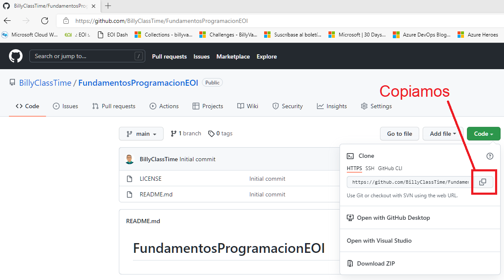

# Objetivos de la mañana de hoy

1 - Instalar un editor de markdown (CONSEGUIDO)

[GUIA BREVE MARKDOWN ](http://fobos.inf.um.es/R/taller5j/30-markdown/guiabreve.pdf)


2 - Explorar GitHub (CONSEGUIDO)

```
Billy
10:08 AM

github.com/BillyClassTime/FundamentosProgramacionEOI

Lina María Vásquez Salazar
10:08 AM

github.com/Linamarv7/FundamentosProgramacionEOI

David Rey de Viñas Velázquez
10:08 AM

github.com/redevv/FundamentosProgramacionEOI

Iván Álamo Exposito
10:08 AM

github.com/Ivanfinal/FundamentosProgramacionEOI

Francisco Vida Vílchez
10:08 AM

github.com/FranciscoVida/FundamentosProgramacionEOI

Mario Álvarez Gómez
10:08 AM

github.com/Marioalvgmz/FundamentosProgramacionEOI

Rafael Alejandro Ojeda Nicieza
10:08 AM

github.com/rojeda16/fundamentosprogramacionEOI

Cristina Silván Sadoc
10:08 AM

github.com/CristinaSilvan/FundamentosProgramacionEOI

Julia Pérez Mora
10:08 AM

github.com/Juliafperez/FundamentosProgramacionEOI 

David González López
10:09 AM

github.com/davidgonzalezlopez96/fundamentos-EOI

Álvaro Morales Marquez
10:09 AM

github.com/alvaromrls/FundamentosProgramacionEOI

Samuel Tirao Martos
10:09 AM

github.com/TMSamuel/FundamentosProgramacionEOI

Vanessa Machordom Torres
10:09 AM

github.com/vmachord/FundamentosProgramacionEOI

Miguel Villar Zamora
10:09 AM

https://github.com/MiguelVillarZamora/FundamentosProgramacionEOI

AMAIA SANCHIS BALLESTER
10:09 AM

github.com/amaiasanchis/FundamentosProgramacionEOI

Juan Antonio Cejudo Algar
10:09 AM

github.com/jacs2501/Curso_cloud_computing

Cynthia Martín Martínez
10:09 AM

github.com/Cynthiamm13/fundamentos/tree/main

Diego Rodriguez Sanchez
10:09 AM

github.com/dugalatortuga/FundamentosProgramacionEOI

PAULA CARRASCAL MARTINEZ
10:09 AM

github.com/pcarrascal/FundamentosProgramacionEOI

Antonio Daza Dueñas
10:09 AM

github.com/DdDaza22/FundamentosProgramacionEOI

Daniel López Doncel-Moriano
10:09 AM

github.com/DlopezDoncelMoriano/Fundamentos-programaci-n-EOI

Iván Salas Carrascal
10:09 AM
github.com/salcarivan/salcarivan/new/main

Emiliano Julian Salvachua
10:10 AM
https://github.com/emiarg10/FundamentosProgramacionEOI

Bautista Gabriel Day García
10:10 AM
github.com/bautiday/FundamentosProgramacionEOI
```


3 - Explorar Git  

1. ​      Descargar e instalar el git (CONSEGUIDO)

​			  https://git-scm.com/download/win

2. Usar el git creando un repositorio local por primera vez **(SOLO LA PRIMERA VEZ)**

   CONFIGURACION INICIAL 
   
   2.1 Crear una carpeta de trabajo

```
c:> cd -- Cambia de carpeta, md -- crea carpeta, rd -- borra carpeta
    cls -- limpiar la ventana de command prompt
    
c:>MD 00-EOI
C:>CD 00-EOI
```

​      2.2 Comprobar que el GIT esta instalado 

```
c:>git
```

​     2.3 Crear un repositorio local

```
c:> git init 
Initialized empty Git repository in C:/00-EOI/.git/
```

​    2.4 Revisar la configuración global al ordenador de GIT (La respuesta es que no tiene configuración global)

```
c:>git config --global -l
fatal: unable to read config file 'C:/Users/WDAGUtilityAccount/.gitconfig': No such file or directory
```

​    2.5 Establecemos el usuario y el correo electrónico

```
c:>git config --global user.name "BillyClassTime"
```

```
c:>git config --global email="billy@billyclasstime.com" 
```
2.6 Comprobar la configuración global previamente establecida

```
c:>git config --global -l
user.name=BillyClassTime
user.email=billy@billyclasstime.com
```

3. Establecer una conexión entre mi repositorio local y el repositorio remoto (GITHUB)

```
IR AL GITHUB -> COPIAR la ruta del repositorio de git
```



Establecemos la conexion

```
git remote add main https://github.com/BillyClassTime/FundamentosProgramacionEOI.git
```


CONFIRMACION DE NUESTRO USUARIO DE GITHUB

PANTALLAZO