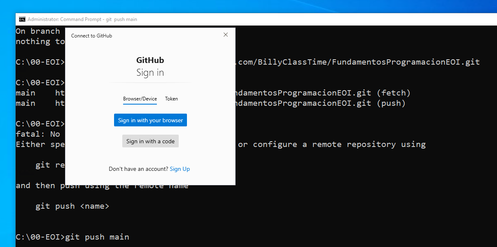
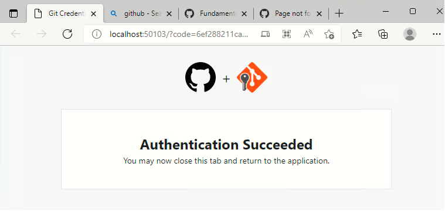

# Objetivos de la mañana de hoy

## 1 - Instalar un editor de markdown (CONSEGUIDO)

[GUIA BREVE MARKDOWN ](http://fobos.inf.um.es/R/taller5j/30-markdown/guiabreve.pdf)


## 2 - Explorar GitHub (CONSEGUIDO)

[BillyClassTime](https://github.com/BillyClassTime/FundamentosProgramacionEOI)

[Lina María Vásquez Salazar](https://github.com/Linamarv7/FundamentosProgramacionEOI)

[David Rey de Viñas Velázquez](https://github.com/redevv/FundamentosProgramacionEOI)

[Iván Álamo Exposito](https://github.com/Ivanfinal/FundamentosProgramacionEOI)

[Francisco Vida Vílchez](https://github.com/FranciscoVida/FundamentosProgramacionEOI)

[Mario Álvarez Gómez](https://github.com/Marioalvgmz/FundamentosProgramacionEOI)

[Rafael Alejandro Ojeda Nicieza](https://github.com/rojeda16/fundamentosprogramacionEOI)

[Cristina Silván Sadoc](https://github.com/CristinaSilvan/FundamentosProgramacionEOI)

[Julia Pérez Mora](https://github.com/Juliafperez/FundamentosProgramacionEOI) 

[David González López](https://github.com/davidgonzalezlopez96/fundamentos-EOI)

[Álvaro Morales Marquez](https://github.com/alvaromrls/FundamentosProgramacionEOI)

[Samuel Tirao Martos](https://github.com/TMSamuel/FundamentosProgramacionEOI)

[Vanessa Machordom Torres](https://github.com/vmachord/FundamentosProgramacionEOI)

[Miguel Villar Zamora](https://github.com/MiguelVillarZamora/FundamentosProgramacionEOI)

[AMAIA SANCHIS BALLESTER](https://github.com/amaiasanchis/FundamentosProgramacionEOI)

[Juan Antonio Cejudo Algar](https://github.com/jacs2501/Curso_cloud_computing)

[Cynthia Martín Martínez](https://github.com/Cynthiamm13/fundamentos/tree/main)

[Diego Rodriguez Sanchez](https://github.com/dugalatortuga/FundamentosProgramacionEOI)

[PAULA CARRASCAL MARTINEZ](https://github.com/pcarrascal/FundamentosProgramacionEOI)

[Antonio Daza Dueñas](https://github.com/DdDaza22/FundamentosProgramacionEOI)

[Daniel López Doncel-Moriano](https://github.com/DlopezDoncelMoriano/Fundamentos-programaci-n-EOI)

[Iván Salas Carrascal](https://github.com/salcarivan/salcarivan/new/main)

[Emiliano Julian Salvachua](https://github.com/emiarg10/FundamentosProgramacionEOI)

[Bautista Gabriel Day García](https://github.com/bautiday/FundamentosProgramacionEOI)

## 3 - Explorar Git  

### 1. ​      Descargar e instalar el git (CONSEGUIDO)

​			  https://git-scm.com/download/win

### 2. Usar el git creando un repositorio local por primera vez **(SOLO LA PRIMERA VEZ)**

   CONFIGURACION INICIAL  (CONSEGUIDO)

   2.1 Crear una carpeta de trabajo

```
c:> cd -- Cambia de carpeta, md -- crea carpeta, rd -- borra carpeta
    cls -- limpiar la ventana de command prompt
    
c:>MD 00-EOI
C:>CD 00-EOI
```

​      2.2 Comprobar que el GIT esta instalado 

```
c:>git
```

​     2.3 Crear un repositorio local

```
c:> git init 
Initialized empty Git repository in C:/00-EOI/.git/
```

​    2.4 Revisar la configuración global al ordenador de GIT (La respuesta es que no tiene configuración global)

```
c:>git config --global -l
fatal: unable to read config file 'C:/Users/WDAGUtilityAccount/.gitconfig': No such file or directory
```

​    2.5 Establecemos el usuario y el correo electrónico

```
c:>git config --global user.name "BillyClassTime"
```

```
c:>git config --global user.email="billy@billyclasstime.com" 
```

2.6 Comprobar la configuración global previamente establecida

```
c:>git config --global -l
user.name=BillyClassTime
user.email=billy@billyclasstime.com
```

### 3. Establecer una conexión entre mi repositorio local y el repositorio remoto (GITHUB)

 ```
C:>git branch
<no muestra nada>
 ```

3.1 Revisar el status

```
c:> git status
On branch master

No commits yet

Untracked files:
  (use "git add <file>..." to include in what will be committed)
        FICHEROMDVSCODE.md
        img/
```

3.2 Añadir nuestros ficheros al seguimiento

```
c:> git add .
```

3.3 Volvemos a pedir el status

```
c:> git status
On branch master
No commits yet
Changes to be committed:
  (use "git rm --cached <file>..." to unstage)
        new file:   FICHEROMDVSCODE.md
        new file:   img/00.png
        new file:   img/01.png
```

3.4 Confirmar nuestros cambios en local:

```
c:> git commit -m "Estableciendo los primeras pasos"
[master (root-commit) 5822109] Estableciendo los primeros pasos
 3 files changed, 196 insertions(+)
 create mode 100644 FICHEROMDVSCODE.md
 create mode 100644 img/00.png
 create mode 100644 img/01.png
```

3.5 Pedir el status por penultima vez

```
C:\00-EOI>git status
On branch master
nothing to commit, working tree clean
```

3.6 Enlazamos el repositorio local con el remoto

```
IR AL GITHUB -> COPIAR la ruta del repositorio de git
```


3.7 Establecemos la conexion

```
git remote add main https://github.com/BillyClassTime/FundamentosProgramacionEOI.git
```

NOTA:

Borrar la conexión al repositorio remto si es necesario:

```
git remote rm main
```

3.8 Consultar que repositorios remotos estan enlazados a nuestro repositorio local

```
git remote -v
```

3.9 Actualizamos el repositorio remoto (GitHub)

```
git push main
```

3.10 CONFIRMACION DE NUESTRO USUARIO DE GITHUB



3.11 Finalización de la autorización




### 4. BUCLE

4.1  - Hacer las actualizaciones en los ficheros, imagenes, programas, carpetas y demás elementos de nuestro proyecto.

4.2  - Informar a git de los cambios:

```
c:><caperta del proyecto> git add .
```

4.3 - Actualizar nuestro repositorio LOCAL o Confirmación de los cambios.

```
c:><caperta del proyecto> git commit -m "<TEXTO CON LA OBSERVACION DE LA CONFIRMACION"
```

4.4 - Actualizamos al remoto (NO LO VEREMOS EN GITHUB)

```
c:><caperta del proyecto> git push main
```

4.5 - Revisar el status

```
c:><caperta del proyecto>git status
```

> Vuelta al No. 4.1
>


Recapitulación Viernes / Lunes


